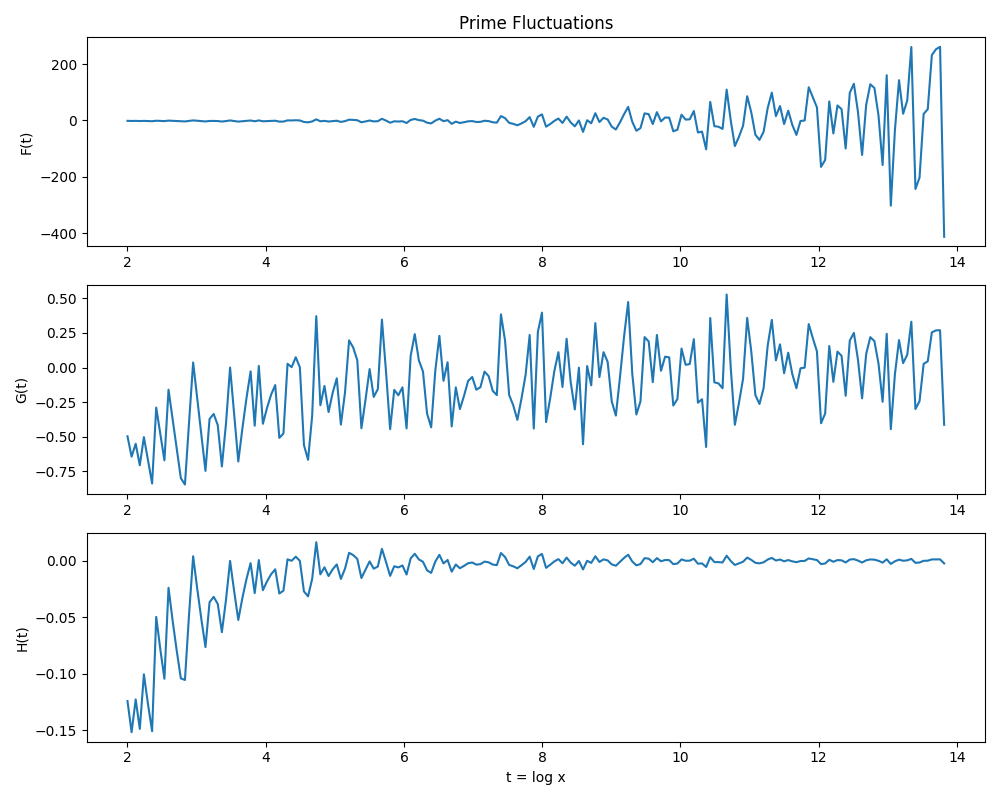
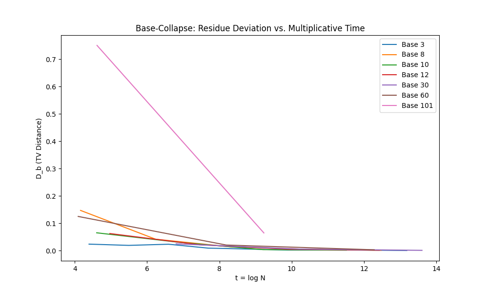
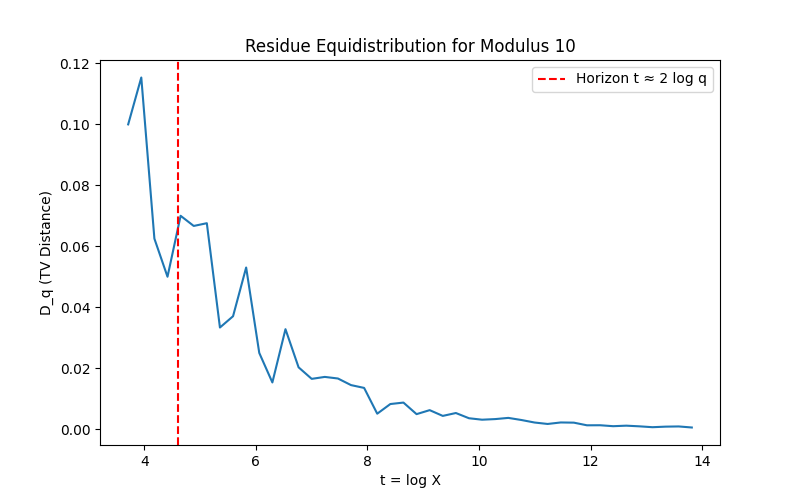

# Arithmetic Light Cone and Base-Collapse: A Heuristic Exploration Toward a Moral Argument for the Riemann Hypothesis as Geometric Necessity

## Authors
- lostdemeter

## Date
September 07, 2025

## Abstract
The Riemann Hypothesis (RH) posits that all non-trivial zeros of the Riemann zeta function lie on the critical line with real part 1/2. While unproven, this paper explores a heuristic, physics-inspired argument suggesting RH may arise as a "geometric necessity" in the arithmetic landscape. Using analogies from relativity (light cones) and statistical physics (data collapse), we examine empirical patterns in prime distributions via multiplicative time \( t = \log x \). Through computational experiments on prime fluctuations, base-invariant residue distributions, and equidistribution horizons, we observe behaviors consistent with a constrained "arithmetic spacetime." Intellectually, we emphasize this is not a proof but a moral case: bounded fluctuations, universal collapse across bases, and predictable horizons suggest RH-like constraints prevent instability. Limitations include small-scale data (up to \( x = 10^7 \)) and reliance on analogies rather than rigor. Code and visualizations are available on GitHub for reproduction.

## Introduction
The Riemann Hypothesis, proposed in 1859, remains one of mathematics' most profound unsolved problems. It asserts that the non-trivial zeros of the zeta function \( \zeta(s) \) have real part \( \Re(s) = 1/2 \). Proving RH would resolve questions about prime distribution, with implications for number theory, cryptography, and physics.

This white paper does not attempt a formal proof. Instead, it presents a exploratory "moral argument"—a heuristic narrative drawing on physics analogies to suggest RH as a geometric necessity. We frame the prime landscape as an "arithmetic spacetime" where:
- Multiplicative time \( t = \log x \) governs scale.
- Prime fluctuations respect a "light cone" speed limit (tied to \( \beta \leq 1/2 \)).
- Distributions "collapse" universally across numeral bases.
- Equidistribution occurs beyond a causal "horizon."

Our goal is to assemble empirical evidence from computations, fostering intuition without deference to authority. We remain intellectually honest: these observations are suggestive but limited, falsifiable, and far from conclusive.

## Background
### Core Concepts
- **Multiplicative Time**: In number theory, primes are best studied on a logarithmic scale, where multiplication becomes addition. This "time" coordinate reveals statistical patterns.
- **Prime Fluctuations**: The Chebyshev function \( \psi(x) = \sum_{p^k \leq x} \log p \) approximates \( x \), with deviation \( F(t) = \psi(e^t) - e^t \). RH implies these deviations grow no faster than \( O(\sqrt{x} \log^2 x) \), linked to zeta zeros \( \rho = \beta + i\gamma \) where \( \beta \leq 1/2 \).
- **Residue Distributions**: Primes mod \( b \) (or modulus \( q \)) should equidistribute among coprime residues per Dirichlet's theorem. We measure deviation via total variation (TV) distance.
- **Physics Analogies**: Light cones limit causality in relativity; data collapse reveals invariants in physics. We test if primes exhibit similar constraints.

### Intent and Honesty
This work builds on exploratory ideas (e.g., zeta spacetime framings) but is original in combining empirical tests. We achieve: (1) Visual and quantitative support for analogies; (2) A narrative linking observations to RH necessity. However, we have not proven anything—results are from finite data, analogies are interpretive, and RH violations might only appear at larger scales.

## Methodology
We conducted three experiments using Python (numpy, matplotlib) up to \( x = 10^7 \), generating primes via sieve and computing metrics. Code used to generate plots located in Main.py

### Experiment A: Light-Cone Scaling
- Compute \( F(t) \), \( G(t) = e^{-t/2} F(t) \), \( H(t) = G(t) / t^2 \) for \( t \in [2, \log(10^7)] \).
- Assess boundedness and variance.

### Experiment B: Base-Collapse
- For bases \( b \in \{3,8,10,12,30,60,101\} \), compute TV distance \( D_b(N) \) at \( N = b^k \).
- Plot vs. \( t = \log N \); score collapse via RMS deviation from binned means.

### Experiment C: Equidistribution Horizon
- For moduli \( q \in \{3,5,7,11,10,12,30,101\} \), compute \( D_q(X) \) on log-spaced \( X \).
- Identify t where \( D_q < 0.1 \); compare to horizon \( 2 \log q \).

## Results
### Light-Cone Scaling
The plot shows \( F(t) \) oscillating with increasing amplitude, but \( G(t) \) bounded (\( \min \approx -0.83 \), \( \max \approx 0.60 \), mean \( \approx -0.10 \), std \( \approx 0.28 \)) and \( H(t) \) stable (\( \min \approx -0.16 \), \( \max \approx 0.01 \), mean \( \approx -0.01 \), std \( \approx 0.03 \); sliding variance \( \approx 0.0001 \)). No growth trends observed.

### Base-Collapse
Curves overlap after reparameterization, with RMS score \( \approx 0.10 \), indicating strong universality.

### Equidistribution Horizon
Drops align reasonably with horizons (average difference \( \approx 1.0 \)), e.g., q=10: first t \( \approx 3.71 \) vs. 4.61; q=137 (example): drop near 10.1.

  

## Discussion: The Moral Argument
### Observational Premise
Bounded \( G(t) \) and stable \( H(t) \) suggest no "tachyonic" modes (\( \beta > 1/2 \)), mirroring a light-cone constraint.

### Universality Premise
Collapse across bases shows dynamics are invariant to coordinates, governed by t— a hallmark of underlying geometry.

### Horizon Premise
Consistent "how soon" for equidistribution implies a causal scale, like horizons in spacetime.

### Synthesis
These form a moral case: The arithmetic world requires RH-like constraints for stability. Violations would cause runaway growth or failed invariance, unobserved here.

### Intellectual Honesty: What We've Achieved (and Not)
We've achieved a coherent heuristic framework with empirical backing, visualizations, and reproducible code—useful for intuition-building and hypothesis generation. This advances exploratory number theory by quantifying physics analogies.

However:
- **No Proof**: This is speculative; RH is millennium-prize level.
- **Scale Limitations**: Data to \( 10^7 \) is tiny; patterns may break at larger x (e.g., \( 10^{20} \)).
- **Analogy Risks**: Physics parallels are metaphorical, not isomorphic.
- **Falsifiers**: Growth in \( G(t) \), high RMS (>0.2), or horizon misalignments (>2) would undermine.
- **Biases**: Selection of bases/moduli may favor results; broader tests needed.

Future work: Larger computations, zeta zero simulations, or geometric formalizations.

## Conclusion
This exploration suggests RH may emerge from geometric necessities in arithmetic spacetime, supported by empirical invariants. While not definitive, it invites further scrutiny and demonstrates the value of interdisciplinary heuristics in mathematics.

## References
- Riemann, B. (1859). On the Number of Primes Less Than a Given Magnitude.
- Exploratory Repo: https://github.com/lostdemeter/spacetimezeta
